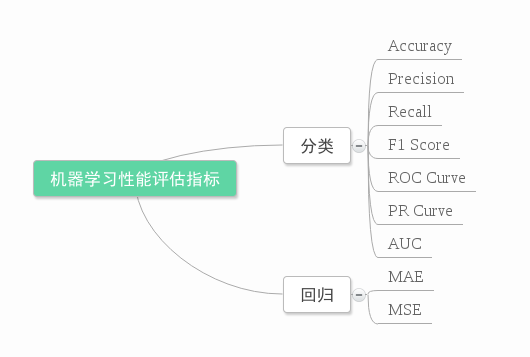

本文章默认在python3.7+上运行

增注：虽然当时看这篇文章的时候感觉很不错，但是还是写在前面，想要了解关于机器学习度量的几个尺度，建议大家直接看周志华老师的西瓜书的第2章：模型评估与选择，写的是真的很好！！

以下第一部分内容转载自：机器学习算法中的准确率(Precision)、召回率(Recall)、F值(F-Measure)是怎么一回事

摘要：

数据挖掘、机器学习和推荐系统中的评测指标—准确率(Precision)、召回率(Recall)、F值(F-Measure)简介。

引言：

在机器学习、数据挖掘、推荐系统完成建模之后，需要对模型的效果做评价。

业内目前常常采用的评价指标有准确率(Precision)、召回率(Recall)、F值(F-Measure)等，下图是不同机器学习算法的评价指标。下文讲对其中某些指标做简要介绍。

【Me】https://github.com/Valuebai/

【参考】
1、出处：地址