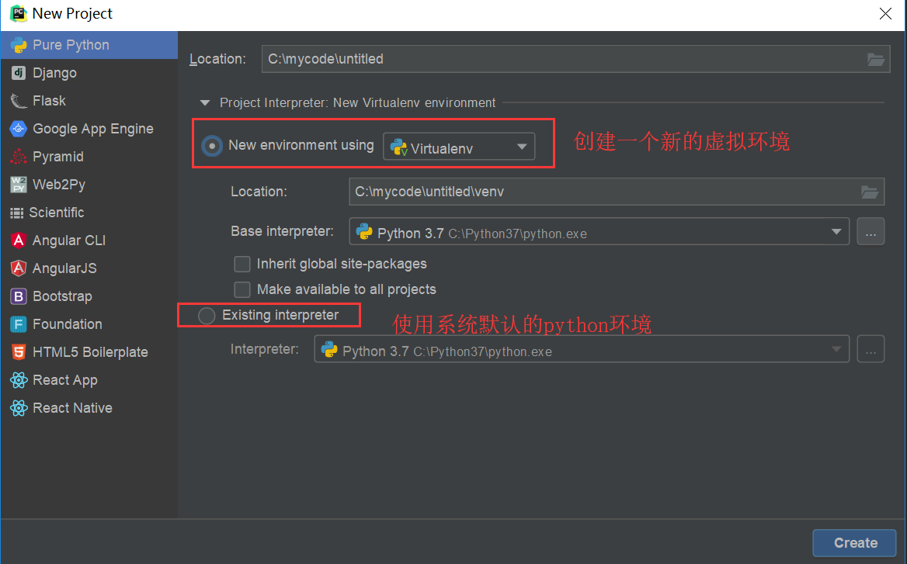

本文章默认在python3.7+上运行，不支持py2

Python 3.3以上使用venv来代替了原来Python2使用的virtualenv创建虚拟环境。

需要注意的是，在Python3.3中使用"venv"命令创建的环境不包含"pip"，你需要进行手动安装。在Python3.4中改进了这一个缺陷。

#### 1、为什么创建虚拟环境

 - 搭建独立的python运行环境，不与系统或其他项目产生冲突
 - 有助于包的管理和防止版本冲突
 - 方便在git clone别人的代码后，安装requirements.txt的版本
 - 删除卸载方便，直接删除对应的虚拟环境文件夹即可

#### 2、在Win/Mac/Linux下创建虚拟环境

##### 2.1 在Windows下创建
2.1.1 创建虚拟环境
``` python
第一步：在本地创建项目的文件夹
第二步：用cmd进入该文件夹路径
P.S. 小技巧：直接打开C:\PythonProject\test_venv——输入cmd即可进入dos窗口
第三步：输入命令搭建虚拟环境：python -m venv . （注：venv 之后一个空格加上一点“.”)
第四步：验证是否安装成功
1. pip install numpy
2. python
3. import numpy
4. print(numpy) 
如果输出了numpy的包路径就表示一切正常。
```
2.1.2 启动/退出虚拟环境

``` python
启动/激活：
1. 进入C:\PythonProject\test_venv\Scripts
2. 输入activate.bat即可

退出：
1. 在激活的虚拟环境状态下(test_venv) C:\PythonProject\test_venv\Scripts>
2. 输入activate.bat即可
3. 或者直接关掉

```

###### 2.2 在Linux下创建（待）
###### 2.3 在Mac下创建（待）

#### 3、在PyCharm下创建虚拟环境
3.1 安装并激活PyCharm
这个请自行安装
官方地址：https://www.jetbrains.com/pycharm/

3.2 在PyCharm下创建虚拟环境
第一步：点击New Project
第二步：选择下图的New environment

第三步：点击create即可
pycharm会为新创建的项目自动建立一个虚拟环境

【参考】
1、venv官网说明：https://docs.python.org/3/library/venv.html
2、"venv"的详细使用参数

``` python
usage: venv [-h] [--system-site-packages] [--symlinks] [--clear]
            [--upgrade] [--without-pip] ENV_DIR [ENV_DIR ...]

Creates virtual Python environments in one or more target directories.

positional arguments:
  ENV_DIR             A directory to create the environment in.

optional arguments:
  -h, --help             show this help message and exit
  --system-site-packages Give access to the global site-packages dir to the
                         virtual environment.
  --symlinks             Try to use symlinks rather than copies, when symlinks
                         are not the default for the platform.
  --copies               Try to use copies rather than symlinks, even when
                         symlinks are the default for the platform.
  --clear                Delete the environment directory if it already exists.
                         If not specified and the directory exists, an error is
                         raised.
  --upgrade              Upgrade the environment directory to use this version
                         of Python, assuming Python has been upgraded in-place.
  --without-pip          Skips installing or upgrading pip in the virtual
                         environment (pip is bootstrapped by default)
```